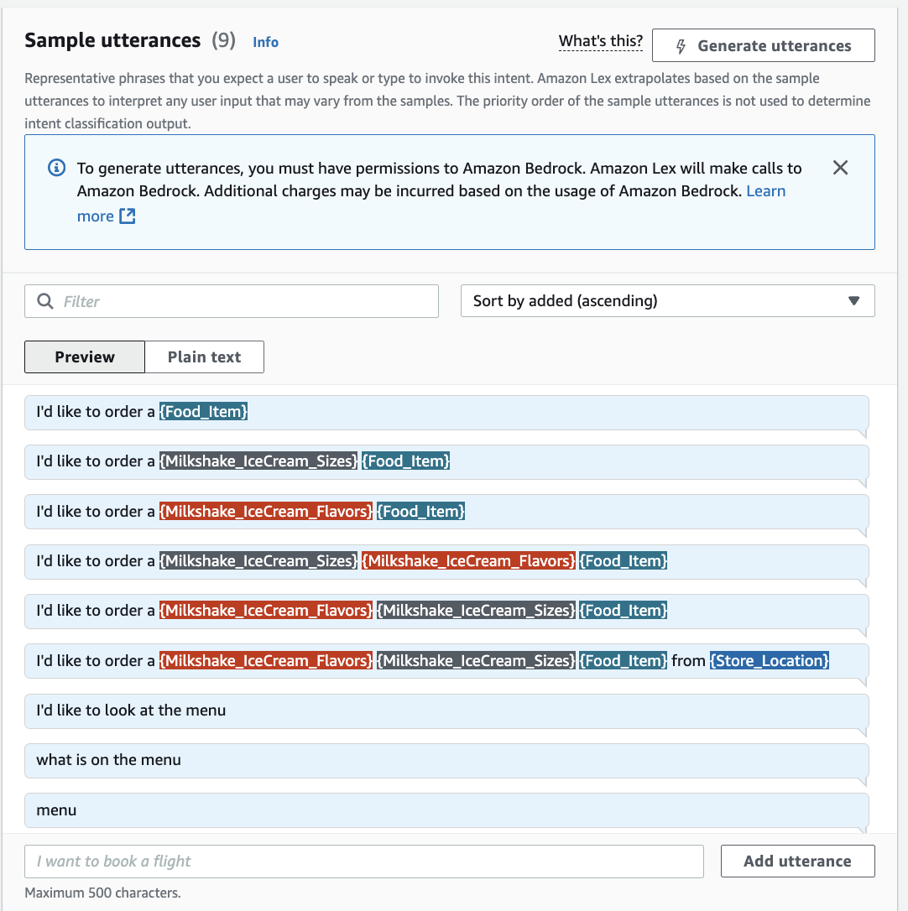

<h1> Restaurant Chatbot hosted on AWS Cloud </h1>

<h3> Overview </h3>

I created __"Danyal's Kitchen"__, a restaurant that sells milkshakes and ice cream in various flavors, sizes, and locations. Customers will be able to visit the restaurant's website and view the menu. On the website, customers can access a chatbot to place their orders. This chatbot can interact with users through both text and speech. To enhance the user experience, I created response cards. This is especially useful for customers who access the chatbot on their phones. The user interface can be seen below along with a link to video:  
 

<h3> Why did I make this project? </h3>

I made this is personal project to showcase my skills in cloud computing. The AWS services I used throughout this project were [Lex](https://aws.amazon.com/lex/), [Lambda](https://aws.amazon.com/lambda/), [S3](https://aws.amazon.com/s3/), [Cloudwatch](https://aws.amazon.com/cloudwatch/) and [IAM](https://aws.amazon.com/iam/). Furthermore I showcased my skills in basic web development by creating a static website to serve as a menu. Once I had created the chatbot, I integrated it onto the static website so that customers can view the menu and place an order using the chatbot on a centralized platform.

<h3> What problems am I solving? </h3>

1. __Reducing Customer Wait Time:__  
   The chatbot's biggest factor in improving customer service is reducing wait times. Many small businesses simply do not have enough staff to answer customer calls at any given moment. During holiday seasons or even just weekends, restaurants receive a high volume of takeout orders. The restaurant chatbot solves all these issues by providing customers with a centralized platform to view the menu and place their orders.

2. __Reducing Operational Costs__  
   Small businesses often operate on tight budgets. The chatbot reduces the need for extra staff by handling customer inquiries, reservations, and orders automatically. It works 24/7, ensuring customers get responses even when the restaurant is closed.

3. __Eliminating Human Error__  
   The restaurant chatbot significantly reduces human error, which is a common challenge in fast-paced food service environments. It does this by ensuring order-taking accuracy, eliminating manual data entry errors, standardizing customer interactions (making sure promotions, if any, are mentioned), and avoids reservation conflicts.
   
<h3> Additional Benefits: </h3>

__Enhancing Efficiency:__ Staff can fully focus their time on serving in-store customers and maximizing takeout order efficiency.

__Multilingual Support:__ If the restaurant serves diverse customers, the bot can communicate in multiple languages.

<h1> How did I make this Chatbot? </h1> 

<h2> Step 1: Create a Bot </h2>

   1. Click "Create Bot" on the Amazon Lex service.
   2. Creation Method: Create a Blank Bot.
   3. Bot Configuration: Give the bot a name and add a description of what the purpose of the bot is (The title of my bot was "DanyalsKitchen").
   4. IAM permissions: select "Create a role with basic Amazon Lex permissions".
   5. Children's Online Privacy Protection Act (COPPA): select "no".
   6. Click "Next" button on the bottom of the screen.
   7. Langauge: Leave the default language as English. Select a preferred text-to-speech voice for your bot (I chose Matthew).
   8. Click "Done" on the bottom of the screen.

<h2> Step 2: Create Slot Types </h2>

__What are slots?__  
 
A slot is a placeholder for user-provided information in a chatbot conversation.  For example, in a restaurant chatbot, a user might say:
"I want to order a small vanilla ice cream for pickup in Mckinney."  
Here "small" (size), "vanilla" (flavor), "ice cream" (item), and "Mckinney" (location) are slot values.

__The slots I created were__:
1. __Food_Item:__ The options are milkshakes or ice cream.
3. __Milkshake_IceCream_Flavors:__ The options are strawberry, chocolate, or vanilla.
4. __Milkshake_IceCream_Sizes:__ The options are small, medium, or large.
5. __Store_Location:__ The options are Mckinney, Frisco, or Posper (These are cities in the DFW area).

**How to Create Slots in Amazon Lex**  
1. Click **"Add slot type"**.  
2. Click **"Add blank slot type"**.  
3. Name the slot type according to the table below.  
4. Set **Slot value resolution** to **Expanded Values**.  
5. Enter the corresponding slot values.  
6. Click **"Save Slot Type"** at the bottom of the screen.  

| **Slot Name**                    | **Slot Values**                            |  
|----------------------------------|-------------------------------------------|  
|  Food_Item                       | Milkshake, Ice Cream                      |  
|  Milkshake_IceCream_Flavors       | Strawberry, Chocolate, Vanilla            |  
|  Milkshake_IceCream_Sizes         | Small, Medium, Large                      |  
|  Store_Location                   | McKinney, Frisco, Prosper                 |  

<h2> Step 2: Create Intents </h2>

__What are intents?__  
 
In Amazon Lex, an intent represents a specific action or goal that a user wants to accomplish through the chatbot. It defines what the user is trying to do in a conversation.

__How Intents Work:__
1. User Input: The chatbot listens to what the user says.
2. Intent Matching: Lex tries to match the user's input to a predefined intent.
3. Slot Filling: If required, the bot asks follow-up questions to collect necessary details (slots).
4. Fulfillment: Once all required slots are filled, the bot executes the action (e.g., placing an order).

For example, if a user says: "I want to order a large chocolate milkshake for pickup in Frisco."
Lex will match this with an intent titled "order_IceCream" and fill in the necassary slots. Once all slots are filled, the bot can confirm the order and process it.

__The intents I created were:__
1. __Greeting:__ The purpose of this intent is to greet the customer. If the customer were to open the chatbot and say "Hello". This would prompt Lex to match with the Greeting intent and respond with "Hello! Welcome to Danyal's Kitchen. Would you like to see our menu?"
3. __Order_Food:__ The purpose of this intent is to get orders from customers and place them at the appropriate locations.. 
4. __FallbackIntent:__ The purpose of this intent is to to respond "Im sorry, I do not understand", to any user inputs that the chatbot cannot recognize or understand. This way customers can retype their inputs.

<h3> How to Create each Intent in Amazon Lex </h3>

__Greeting:__
1. Click **"Intents"**.  
2. Click **"Add empty intent"**.  
3. Name the slot type __"Greeting"__
4. Under __"Sample utterances"__ enter common phrases or words that indicate a greeting. For example, __"hello", "hi", "what's up", "Hey Danyal's Kitchen!"__.
5. Scroll down to __"Closing response"__ and type __"Hello! Welcome to Danyal's Kitchen. Would you like to see our menu?"__
6. Click **"Save intent"** at the bottom of the screen.  
 

__Order_Food:__
1. Click **"Intents"**.
2. Click **"Add empty intent"**.
3. Name the slot type __"Order_Food"__
4. Scroll down to __"Slots"__
5. Click __"Add Slot"__. Click a slot type and name it the exact same as the slot type.
6. Add an appropriate prompt.
7. Repeat steps 5 and 6 for the remaining slot types.
8. Under __"Sample utterances"__ enter the following:
      
9. Under __"Confirmation"__  
&nbsp;&nbsp;&nbsp;&nbsp; a. "Confirmation Prompt": __Alright, so you like I'd like to order a {Milkshake_IceCream_Sizes} {Milkshake_IceCream_Flavors} {Food_Item} from the {Store_Location} location?__  
&nbsp;&nbsp;&nbsp;&nbsp; b. "Decline response": __Okay, please come back when you are ready to order!__
10. Under __"Fulfillment"__  
&nbsp;&nbsp;&nbsp;&nbsp; a. "On successful fulfillment": __Great! I have placed your order for a {Milkshake_IceCream_Sizes} {Milkshake_IceCream_Flavors} {Food_Item} at the {Store_Location} location.__  
&nbsp;&nbsp;&nbsp;&nbsp; b. "In case of failure": __Sorry, something went wrong. Please try again.__
11. Click the checkmark under __Code Hooks__
12. Click **"Save intent"** at the bottom of the screen.  

 

__FallbackIntent:__
1. This intent is already created by Lex by default.
2. Click on the intent and scroll down to the closing response. Update the message to __"Sorry, I can't help with that".__
3. Click **"Save intent"** at the bottom of the screen.  

<h2> Step 3: Create Response Cards </h2>

1. Go back to to the Order_Food intent and scroll down to "slots"
2. Click on each of the 4 slots and click "advanced options"
3. Scroll down to "Slot prompts"
4. Click "Add"
5. Click "Add card group"
6. Navigate to the github files of this repository and download the DK_logo.jpg
7. Upload the jpeg into a S3 bucket called "DanyalsKitchen"
8. copy the URL of image object in S3 and paste it under "Image URL" in Lex
9. Give the card a title, subtitle, and corresponding buttons depending on the slot.
10. Repeat the process for each slot.

<h2> Step 4: Create a Lambda Function </h2>

<h2> Step 5: Grant Lex Permission to access the Lambda Function </h2>

<h2> Step 6: Create a Web Page </h2>

<h2> Step 7: Integrate Chatbot into a Web Page </h2>

