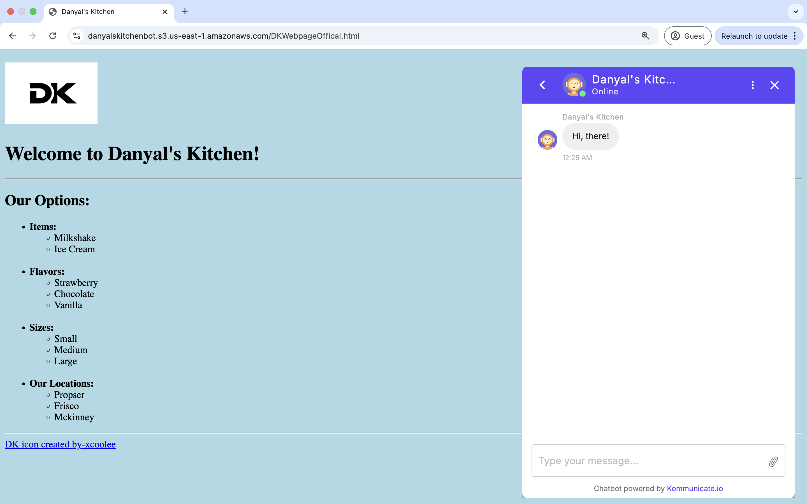

<h1> Restaurant Chatbot hosted on AWS Cloud </h1>

<h3> Overview </h3>

I created __"Danyal's Kitchen"__, a restaurant that sells milkshakes and ice cream in various flavors, sizes, and locations. Customers will be able to visit the restaurant's website and view the menu. On the website, customers can access a chatbot to place their orders. This chatbot can interact with users through both text and speech. To enhance the user experience, I created response cards. This is especially useful for customers who access the chatbot on their phones. The user interface can be seen below along with a link to video:  
 

<h3> Why did I make this project? </h3>

I made this is personal project to showcase my skills in cloud computing. The AWS services I used throughout this project were [Lex](https://aws.amazon.com/lex/), [Lambda](https://aws.amazon.com/lambda/), [S3](https://aws.amazon.com/s3/), [Cloudwatch](https://aws.amazon.com/cloudwatch/) and [IAM](https://aws.amazon.com/iam/). Furthermore I showcased my skills in basic web development by creating a static website to serve as a menu. Once I had created the chatbot, I integrated it onto the static website so that customers can view the menu and place an order using the chatbot on a centralized platform.

<h3> What problems am I solving? </h3>

1. __Reducing Customer Wait Time:__  
   The chatbot's biggest factor in improving customer service is reducing wait times. Many small businesses simply do not have enough staff to answer customer calls at any given moment. During holiday seasons or even just weekends, restaurants receive a high volume of takeout orders. The restaurant chatbot solves all these issues by providing customers with a centralized platform to view the menu and place their orders.

2. __Reducing Operational Costs__  
   Small businesses often operate on tight budgets. The chatbot reduces the need for extra staff by handling customer inquiries, reservations, and orders automatically. It works 24/7, ensuring customers get responses even when the restaurant is closed.

3. __Eliminating Human Error__  
   The restaurant chatbot significantly reduces human error, which is a common challenge in fast-paced food service environments. It does this by ensuring order-taking accuracy, eliminating manual data entry errors, standardizing customer interactions (making sure promotions, if any, are mentioned), and avoids reservation conflicts.
   
<h3> Additional Benefits: </h3>

__Enhancing Efficiency:__ Staff can fully focus their time on serving in-store customers and maximizing takeout order efficiency.

__Multilingual Support:__ If the restaurant serves diverse customers, the bot can communicate in multiple languages.

<h1> How did I make this Chatbot? </h1> 

<h2> Step 1: Create a Bot </h2>

   1. Click "Create Bot" on the Amazon Lex service.
   2. Creation Method: Create a Blank Bot.
   3. Bot Configuration: Give the bot a name and add a description of what the purpose of the bot is (The title of my bot was "DanyalsKitchen").
   4. IAM permissions: select "Create a role with basic Amazon Lex permissions".
   5. Children's Online Privacy Protection Act (COPPA): select "no".
   6. Click "Next" button on the bottom of the screen.
   7. Langauge: Leave the default language as English. Select a preferred text-to-speech voice for your bot (I chose Matthew).
   8. Click "Done" button on the bottom of the screen.

<h2> Step 2: Create Slot Types </h2>

   1. 

<h2> Step 2: Create Intents </h2>

   1. Click on "Intents"
   2. Click on the "FallbackIntent" intent.
   3. Scroll down to closing response. Update the message to "Sorry, I can't help with that".

   1. Click "Add intent".
   2. Click "Add empty intent".
   3. Name the intent "Order_Food"

<h2> Step 3: Create Response Cards </h2>

<h2> Step 4: Create a Lambda Function </h2>

<h2> Step 5: Grant Lex Permission to access the Lambda Function </h2>

<h2> Step 6: Create a Web Page </h2>

<h2> Step 7: Integrate Chatbot into a Web Page </h2>

